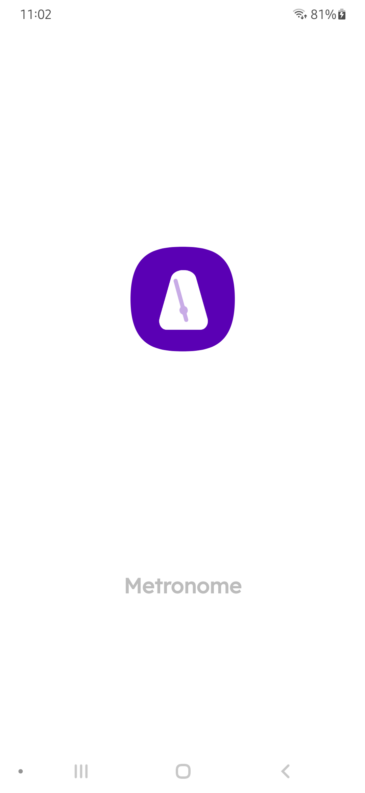
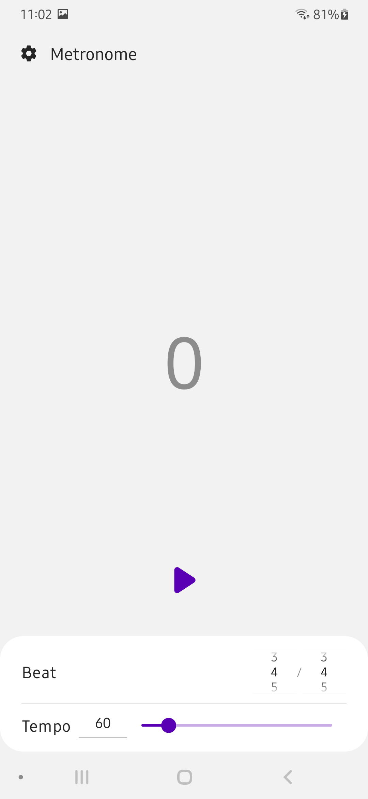
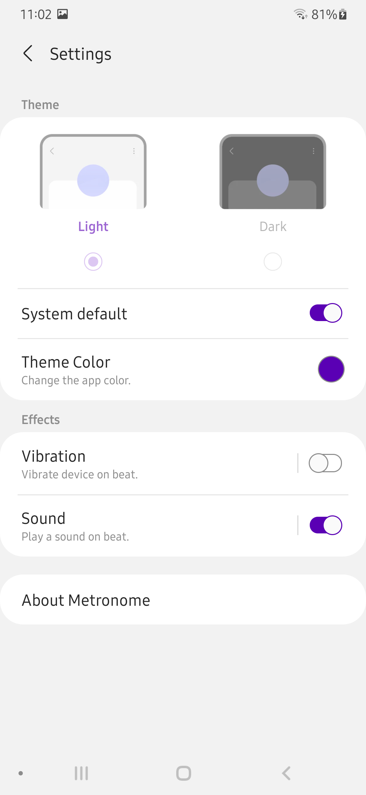

# Metronome
A simple Metronome app for Android with adjustable bpm, multiple sounds and vibration intensity. Like all my apps, it is using my [oneui library](https://github.com/Yanndroid/OneUI-Design-Library). You can download and install the latest apk [here](https://github.com/Yanndroid/Metronome/raw/master/app/release/app-release.apk), future updates can be done directly in the app.

   